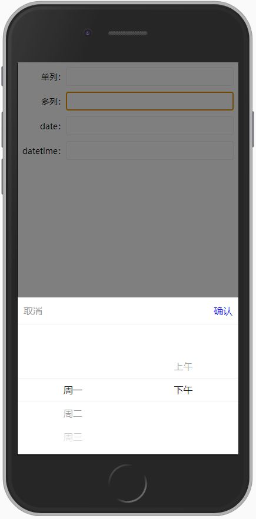
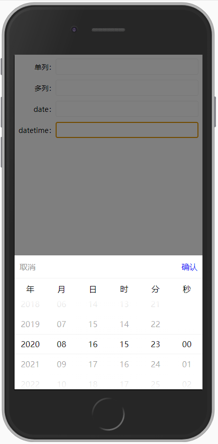

# picker

原生实现，不依赖于任何第三方库。

## [在线demo](http://ww.baidu.com)

## 引入

```html
<!-- 引入样式 -->
<link ref="stylesheet" href="picker.css">

<!-- 引入js -->
<script src="picker.js"></script>
```

## 调用

```javascript
new Picker('.singleSelect', {
    columns: [
        {
            selected: 2,
            options: [
                {
                    key: 1,
                    value: '选项1'
                },
                {
                    key: 2,
                    value: '选项2'
                },
                {
                    key: 3,
                    value: '选项3'
                }
            ]
        },
    ]
});
```


----

```javascript
new Picker('.multiSelect', {
    columns: [
        {
            selected: 1,
            options: [
                {
                    key: 1,
                    value: '周一'
                },
                {
                    key: 2,
                    value: '周二'
                },
                {
                    key: 3,
                    value: '周三'
                },
                {
                    key: 4,
                    value: '周四'
                },
                {
                    key: 5,
                    value: '周五'
                },
                {
                    key: 6,
                    value: '周六'
                },
                {
                    key: 7,
                    value: '周日'
                },
            ]
        },
        {
            selected: 2,
            options: [
                {
                    key: 1,
                    value: '上午'
                },
                {
                    key: 2,
                    value: '下午'
                },
            ]
        }
    ]
});
```



----

```javascript
new Picker('.date', {
    type: 'date',
    selected: '2020-08-16',
    on: {
        confirm: function (target, resultList) {
            target.value = resultList.map(function (item) {
                return item.value
            }).join('-');
        }
    }
})
```


----

```javascript
new Picker('.datetime', {
    type: 'datetime',
    selected: '2020-08-16 15:23:00',
    on: {
        confirm: function (target, resultList) {
            var splitChars = this.config.selected.match(/[^\d]+/g);

            target.value = resultList.map(function (item, index) {
                return item.value + (splitChars[index] || '');
            }).join('');
        }
    }
})
```



----

